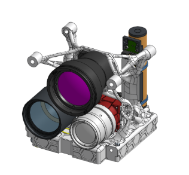

# Payload Subsystem

| Acronyms | Definition |
|---| ---|
|IPU| Image Processing Unit |
| OBC | Onboard Computer |
| NIR | Near Infrared |
| LWIR | Longwave Infrared |
| UHI | Urban Heat Islands |
| GSD | Ground Sample Distance |
| LST | Land Surface Temperature |
| SoM | System on Module |

# Scope

The LUCIA payload is designed to be integrated with an existing ground-based environmental analyzer network. The payload will augment and enhance the network by providing realtime data for scientific and climate analysis for Leeds and surrounding areas. This includes mapping urban heat islands and with a stretch goal defined as pollution analyzers (CO2, NC02). This would further the scope of the payload a lot more and increase complexity. [Jump to further reading](#pollution-analyzers)

## Function

The payload is the primary instrument or experiment for the mission. For LUCIA this includes:s

- Wide Field Camera, designed for panoramic imaging and broad overviews of Leeds
- Telephoto RGB Camera,, focused on high-resolution imaging capturing visual data with the goal of creating time series of 3D models of the urban landscape by photogrammetry
- Infrared Camere, measuring surface temperatures around the city, deteching potential heat islands and assessing the impact of policy and climate change.
- Image Processing Unit, responsible for capture and real-time processsing of the images. As an extention to traditional processing tasks, such as cropping and compression, we hope to use an ML model to intelligently filter, identify and tag relevant images for transmission, this would greatly optimise bandwidth.

## Requirements

## Data Path
- Lens → Sensor → IPU (Payload)
- IPU → OBC → Downlink (through OBC to ground)
- Onboard data processing/compression as needed

## Testing

- Laboratory simulations of expected performance
- Interface testing with OBC and comms

# Visual Data

## Visible & NIR imaging

Our wide-field and telephoto lenses will work with our standard image sensor and enable us to capture high-resolution images, NDVI (vegetation, crop health), NIR-enabled analysis and possibly general machine vision,

## Wide Field Camera

The wide field camera is for capturing the widescreen photos we love so much. It is designed to capture the entirety of Leeds and the West Yorkshire area. The wide-field lenses will use the same sensor as the telephoto lenses.

## Telephoto Camera

# Infrared Imager

## Longwave Infrared (LWIR) Sensor

A LWIR sensor is designed to read the thermal emissions given off by surfaces in an area. The resolution varies typically from 1km tp 100m and potentially even as fine as 3.5m for extremely recent innovations

### Considerations of mapping urban heat (temperature) detection
For true urban heat island detection, you would typically need a dedicated thermal IR camera operating in the 8-14μm range. The typical image sensor, like those used for our telephoto and wide-field lenses are capable of Near-Infrared (NIR) but not accurate enough to detect Longwave Infrared (LWIR) that's needed to measure true surface area. 

# Pollution Analyzers

Pollution analyzers measure certain gases in the atmosphere is wildly varying degrees of accuracy and formats. For most standard, reliable measurements, microwave radiometers are used. A number of components used for this aim need to be cryogenically cooled, which is the further complication noted before in this wiki.

---

### References

- [Open Source Satellite Programme: Payload](https://www.opensourcesatellite.org/)
- [CubeSat Payload Case Studies](https://www.nasa.gov/content/cubesat-launch-initiative)